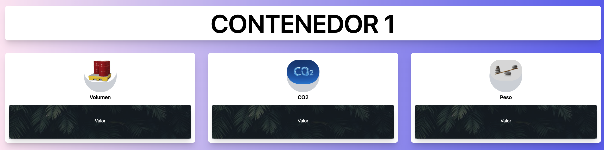
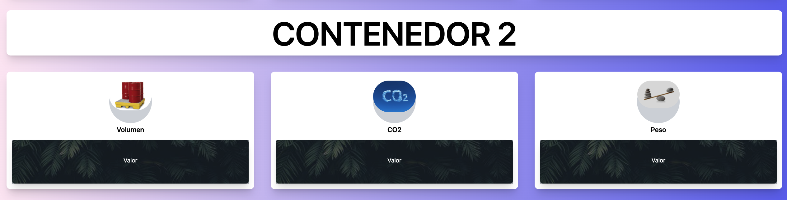

# Red mesh LPWAN mediante el uso del estándar IEEE 802.15.4g para la recolección de datos sobre variables en los contenedores de residuos sólidos del sector Yacucalle - Ibarra - Ecuador

Este proyecto fue desarrollado con las siguientes tecnologías :

- HTML v5.
- Vanilla Javascript.
- TailwindCSS.
- Servicio de MQTT - HIVEMQ [Link](https://www.hivemq.com).
- API Google Maps.
- API Cliente MQTT.

## Previsualización del Proyecto

| No  | Previsualización                                                           |
| --- | -------------------------------------------------------------------------- |
| 1   |  |
| 2   |  |
| 3   |    |

© 2021-2022 ANDREA CUASQUER - UTN

